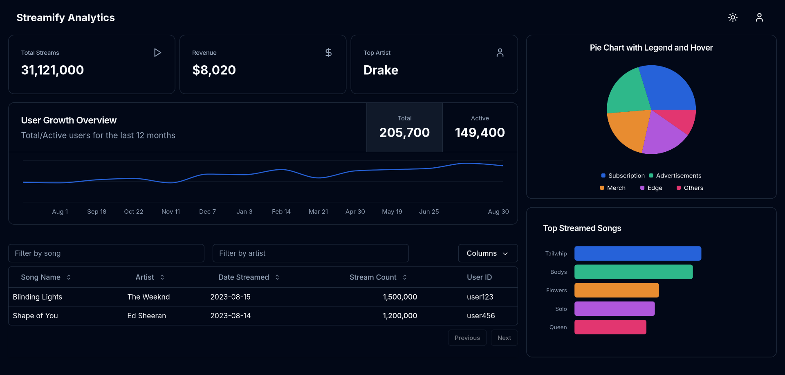
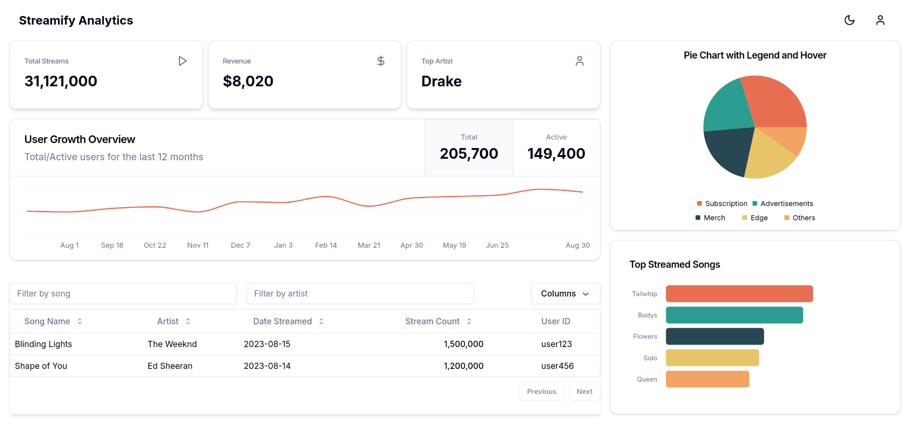

## Streamify Analytics Dashboard

This is a dashboard for the fictional music streaming service "Streamify." The dashboard provides key metrics, data visualizations, and a detailed data table to offer insights into user activity, revenue, and content performance.

### Technologies Used

- Frontend: NextJs 14
- State Management: Zustand
- Component Library: shadcn
- Styling: Tailwind CSS

### Additional Features
- Sorting and filtering functionalities for the data table
- Interactive charts for better data exploration (Try disabling browser extensions if this doesn't work)
- Dark and Light mode
- Fully Responsive

### How to run
Clone the repo and run `npm i` followed by `npm run dev` in the project directory. 

